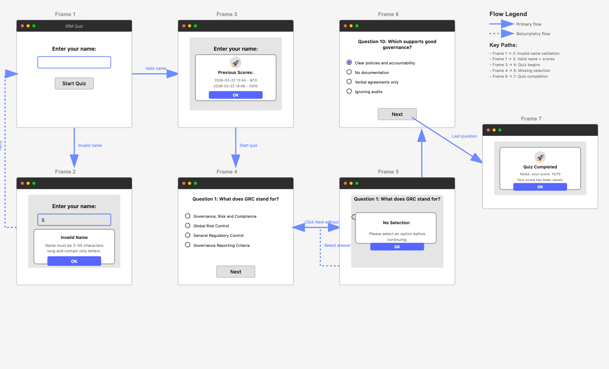
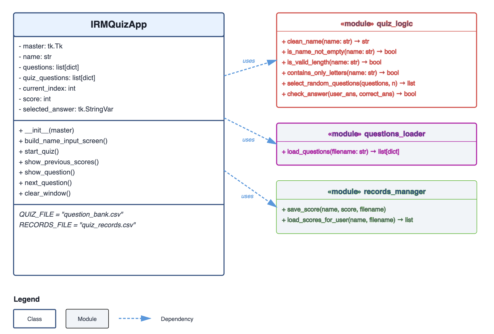
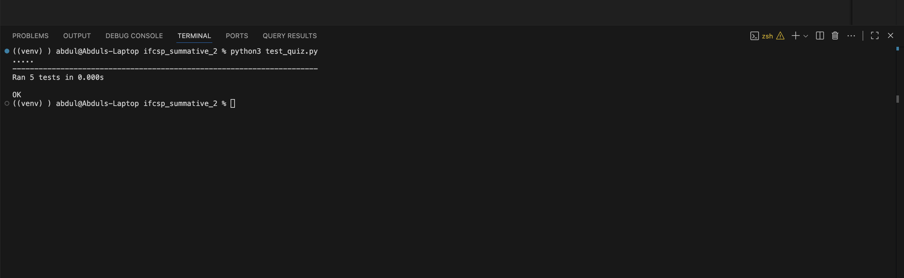

# Integrated Risk Management (IRM) Quiz App

## Introduction
The Integrated Risk Management (IRM) Quiz Application is a minimum viable product (MVP) that was developed to support professional training and onboarding with organisations that utilise ServiceNow’s IRM application, which is their connected solution to the domain of Governance, Risk, and Compliance (GRC). As regulatory expectations and governance requirements continue to increase across industries, reliable methods to assess staff are required to identify if they possess foundational knowledge of GRC principles before being assigned system responsibilities. IRM relies on structured processes to identify operational risks, manage policy compliance, document internal controls, and maintain audit readiness. 

In practice, onboarding and role transitions often require individuals to demonstrate baseline understanding before being granted access to risk registers, control testing workflows, or compliance modules. But, smaller teams or departments may not have access to sophisticated learning management systems or automated assessment tools, creating the need for a lightweight, locally deployable solution that can support knowledge validation in a consistent and structured manner.

The proposed MVP addresses this requirement through the development of a desktop-based quiz application built in Python using Tkinter. The application enables participants to complete a multiple-choice assessment focused on ServiceNow IRM concepts. User inputs are validated to ensure data integrity, and responses are written to a CSV file for persistent storage. This storage format ensures compatibility with widely used office tools, which allows supervisors to review or analyse outcomes without specialised software.

Offering a straightforward method of knowledge validation will help the application to support governance awareness, contribute to ensuring compliance standards, and encourage accountability. Its modular design allows for future enhancement, like additional reporting features or expanded question banks, which can help to ensure that the tool can evolve alongside organisational requirements. 

## Design

### GUI Design

**Figure 1** displays the structured GUI flow to ensure both usability and data integrity. The design is organised into a series of frames, where each frame represents a distinct interaction state.


**Figure 1: Wireframe Design** 
(Source: Own design)

#### Frame 1: Initial Name Entry

The purpose of this frame is to collect the user's name to personalise the quiz experience and to use this name to store their quiz score upon completion, so that it can be retrieved and displayed before another attempt. The components will consist of a text entry field and a "Start Quiz" button. If their name input is invalid, frame is shifted to frame 2 (Validation Error). If their name input is valid, the frame is shifted to frame 3 (Previous Scores).

#### Frame 2: Name Validation Error

This frame is triggered when the user's input to the name field is invalid (due to not fulfilling the requirements of it not being empty, being out of the 2-50 character range, and/or using special characters). The components will consist of a modal dialogue with "Invalid Name", along with an error message and an "OK" button. The user will then reutrn to frame 1 to re-attempt a valid input.

#### Frame 3: Previous Scores Display

This frame is triggered when the user has completed a quiz before and enters a valid name that already exists in the CSV. The components of this will be a modal dialogue listing the previous scores with timestamps in the format "X/10 on YYYY-MM-DD HH:MM", along with an "OK" button that will take the user to frame 4 (Quiz Question Display).

#### Frame 4: Quiz Question Display

The purpose of this frame is to present individual quiz questions with multiple-choice options. The components will consist of a question header (e.g., "Question 3:...") with 4 radio button options and a next button to submit an answer. The user will have to select an option before pressing the next button to avoid an error within frame 5 (No Selection Error). Questions are displayed one at a time and are randomly selected from the question bank.

#### Frame 5: No Selection Error

This frame is triggered when the user attempts to proceed with the quiz without selecting an answer. The components of this frame will be a modal dialogue with the message "Please select an option before continuing", an error message, and an "OK" button to retry selecting an option (Frame 4) before moving on.

#### Frame 6: Question with Selection

This frame is triggered when the user selects an answer and presses "Next". This will validate the answer and update the user's score accordingly. The question index will then be advanced. The frame will return to frame 4 or proceed to frame 7 (Quiz Completion) if the last question of the quiz is completed.

#### Frame 7 Quiz Completion

This frame is triggered when the last question of the quiz is answered. The components of this frame will be a modal dialogue with the message "(User's Name), your score: X/10
Your score has been saved." and an "OK" button to close the application. The user's score will be saved to "quiz_records.csv" with a timestamp, and the application will then be closed when the user presses the okay button.


#### User Journey Example

**Scenario:** Abdul takes the quiz for the second time

1. **Frame 1:** Abdul enters "Abdul" and clicks Start Quiz
2. **Frame 3:** System shows Abdul's previous score: 9/10 from yesterday
3. **Frame 4:** Abdul sees Question 1 about GRC
4. **Frame 4 → 6:** Abdul selects answers for Questions 1-9
5. **Frame 6:** Abdul selects answer for Question 10 (last question)
6. **Frame 7:** System shows "Abdul, your score: 10/10. Your score has been saved."
7. Abdul clicks OK and application closes


### Functional and Non-functional Requirements

#### Functional Requirements
**Table 1:** Functional Requirements
(Source: Own data)

| ID  | Requirement |
| ---- | ---------------------------------------------------------------------------------------------------------- |
| FR1  | The application must allow a participant to enter their name before starting the quiz.|
| FR2  | The application must validate that the name is not empty.|
| FR3  | The application must validate that the name is between 2 and 50 characters in length.|
| FR4  | The application must validate that the name contains only alphabetic characters and spaces.|
| FR5  | The application must display an error message if the name is invalid and prevent progression.|
| FR6  | The application must retrieve and display previous quiz scores for returning users.|
| FR7  | The application must skip the previous score display if the user has no prior attempts.|
| FR8  | The application must randomly select 10 questions from the question bank.|
| FR9  | The application must display one multiple-choice question at a time.|
| FR10 | Each question must provide four selectable answer options.|
| FR11 | The application must prevent the user from proceeding without selecting an answer.|
| FR12 | The application must display an error message if the user attempts to proceed without selecting an answer.|
| FR13 | The application must compare the selected answer with the correct answer and update the score accordingly.|
| FR14 | The application must display the final score at the end of the quiz.|
| FR15 | The application must store the participant’s name, score, and timestamp in a CSV file upon completion.|
| FR16 | The application must notify the user that their score has been saved.|
| FR17 | The application must close cleanly after the quiz is completed and acknowledged.|

#### Non-functional Requirements
**Table 2:** Non-functional requirements
(Source: Own data)

| ID | Requirement|
| ----- | ------------------------------------------------------------------------------------------------------- |
| NFR1  | The user interface must be clear, readable, and easy to navigate.|
| NFR2  | Text and background elements must provide sufficient contrast for readability.|
| NFR3  | The application must respond instantly to user interactions such as button clicks and answer selection.|
| NFR4  | The system must not crash if the score file does not exist and must handle file errors gracefully.|
| NFR5  | The application must run as a standalone desktop application using Python 3.|
| NFR6  | The application must follow a modular structure separating GUI, logic, and data storage.|
| NFR7  | Stored data must be human-readable and accessible using standard spreadsheet software.|
| NFR8  | The application must maintain data integrity by preventing blank names or skipped questions.|
| NFR9  | The codebase should be maintainable with clear naming conventions and documentation.|
| NFR10 | The system should require no external dependencies beyond Python’s standard library.|

### Tech Stack Outline
- [Python 3](https://docs.python.org/3/) — core programming language (3.9+)
- [Tkinter](https://docs.python.org/3/library/tkinter.html) — desktop graphical user interface framework
- [csv](https://docs.python.org/3/library/csv.html) — data persistence for questions and quiz records
- [datetime](https://docs.python.org/3/library/datetime.html) — timestamp generation for quiz attempts
- [random](https://docs.python.org/3/library/random.html) — question randomisation for each quiz session
- [unittest](https://docs.python.org/3/library/unittest.html) — automated unit testing framework

### Code Design

**Figure 2** displays a class design, providing an understandable, modular, and structured blueprint for components that make up this applciation


**Figure 2: Class Design** 
(Source: Own design)

## Development

The app is structured across 4 Python modules, each serving different purposes:

main.py - The `IRMQuizApp` class controls the entire app flow:

```python
def __init__(self, master):
    self.master = master
    self.name = ""
    self.questions = load_questions(QUIZ_FILE)
    self.quiz_questions = []
    self.current_index = 0
    self.score = 0
    self.selected_answer = tk.StringVar()
    self.build_name_input_screen()
```

The initialisation loads all questions from CSV, establishes state variables for tracking quiz progress, and displays the name entry screen. The `start_quiz()` method validates user input using 3 pure functions (`is_name_not_empty()`, `is_valid_length()`, `contains_only_letters()`), displays previous scores if available, randomly selects 10 questions, and begins the quiz.

quiz_logic.py - Contains pure functions for validation and scoring:

```python
def contains_only_letters(name: str) -> bool:
    #Ensure name contains only alphabetic characters and spaces.
    return name.replace(" ", "").isalpha()

def check_answer(user_answer, correct_answer) -> bool:
    #Compare the user's answer with the correct one.
    return str(user_answer) == str(correct_answer)
```

These pure functions have no side effects, making them easily testable. The `select_random_questions()` function uses `random.sample()` to ensure each quiz attempt has different questions.

questions_loader.py - Reads the question bank CSV:

```python
def load_questions(filename):
    with open(filename, newline="") as file:
        reader = csv.DictReader(file)
        return list(reader)
```

This converts CSV rows into dictionaries where column headers become keys, allowing access to question data via `question['option_a']`.

records_manager.py - Handles persistent storage:

```python
def save_score(name, score, filename="quiz_records.csv"):
    with open(filename, mode="a", newline="") as file:
        writer = csv.writer(file)
        writer.writerow([name, score, datetime.now()])
```

Appends results with timestamps, allowing historical tracking of user performance.

## Testing

### Testing Strategy

The testing approach combines manual testing for GUI functionality and automated unit testing for business logic:

**Manual Testing** - Used for validating user interface interactions, screen transitions, and modal dialogues. This approach is appropriate for GUI components that are difficult to automate and require visual verification.

**Automated Unit Testing** - Applied to pure functions in `quiz_logic.py` using Python's `unittest` framework. This ensures validation rules and scoring logic remain correct as the codebase evolves. Pure functions are ideal for unit testing because they produce predictable outputs for given inputs.

#### Manual Testing Outcomes
**Table 3:** Manual Testing Outcomes
(Source: Own data)

| Test Case | Test Data | Expected Outcome | Actual Outcome | Pass/Fail |
|-----------|-----------|------------------|----------------|-----------|
| Empty name validation | "" (empty string) | Error message: "Name must be 2–50 characters long and contain only letters." | Error dialogue displayed, remains on name entry screen | Pass |
| Short name validation | "A" | Error message displayed | Error dialogue displayed correctly | Pass |
| Name with numbers | "Abdul123" | Error message displayed | Error dialogue displayed correctly | Pass |
| Valid name entry | "Abdul Amin" | Name accepted, proceeds to quiz | Name cleaned to "Abdul Amin", quiz starts | Pass |
| Previous scores display | "Abdul" (existing user) | Modal showing previous scores with timestamps | Previous scores displayed correctly in format "9/10 on 2026-02-22 13:44" | Pass |
| Question navigation without selection | Click "Next" without selecting answer | Error message: "Please select an option before continuing." | Error dialogue displayed, remains on current question | Pass |
| Correct answer submission | Select correct answer, click "Next" | Score incremented, next question displayed | Score updated (not visible to user), progresses to next question | Pass |
| Quiz completion | Answer all 10 questions | Completion modal with final score, score saved to CSV | Modal displays "Abdul, your score: 9/10. Your score has been saved." | Pass |
| CSV record persistence | Complete quiz | New row added to `quiz_records.csv` | Record written: "Abdul,10,2026-02-22 14:06:39.717831" | Pass |

#### Unit Testing Outcomes

The `test_quiz_logic.py` module tests all pure functions:

```python
class TestQuizLogic(unittest.TestCase):
    def test_clean_name(self):
        self.assertEqual(clean_name("  abdul  "), "Abdul")
    
    def test_is_name_not_empty(self):
        self.assertTrue(is_name_not_empty("Abdul"))
        self.assertFalse(is_name_not_empty(""))
    
    def test_valid_length(self):
        self.assertTrue(is_valid_length("Abdul"))
        self.assertFalse(is_valid_length("A"))
    
    def test_contains_only_letters(self):
        self.assertTrue(contains_only_letters("Abdul Amin"))
        self.assertFalse(contains_only_letters("Abdul123"))
    
    def test_check_answer(self):
        self.assertTrue(check_answer("1", "1"))
        self.assertFalse(check_answer("2", "1"))
```

**Figure 3** displays the output of the test execution results within `test_quiz_logic.py`:



**Figure 3: Test Execution Results:**
(Source: Own data)


All 5 unit tests pass successfully, confirming that the validation logic and answer checking function correctly. Tests run in under 0.000 seconds, providing rapid feedback during development.

## Documentation

### User Documentation

**Starting the Quiz:**
1. Run `python3 main.py` from the command line
2. Enter your name (2-50 letters only, spaces allowed)
3. Press "Start Quiz" - if you've taken the quiz before, your previous scores will be displayed
4. Read each question and select one of the four radio button options
5. Press "Next" to proceed to the next question
6. After answering all 10 questions, your score will be displayed and automatically saved

**Requirements:**
- Python 3.9 or higher
- Files: `main.py`, `quiz_logic.py`, `questions_loader.py`, `records_manager.py`, `test_quiz_logic.py`, `question_bank.csv`, `quiz_records.csv`

### Technical Documentation

**Running Tests Locally (MacOS):**
```bash
python3 test_quiz_logic.py
```

This executes all unit tests in the `test_quiz_logic.py` module. Tests verify name validation functions and answer checking logic.

**Adding Questions:**

Edit `question_bank.csv` following this format:
```csv
question,option_a,option_b,option_c,option_d,correct
Your question here?,First option,Second option,Third option,Fourth option,1
```

The `correct` field should be "1", "2", "3", or "4" corresponding to options a, b, c, or d.

**Key Code Components:**
- `IRMQuizApp` class: Main GUI controller
- `load_questions()`: Reads question bank CSV
- `select_random_questions()`: Randomly picks 10 questions per quiz
- `check_answer()`: Compares user selection with correct answer
- `save_score()`: Appends results to `quiz_records.csv`

## Evaluation

### What Went Well

**Modular Architecture** - Separating pure functions into `quiz_logic.py` made unit testing straightforward and allowed validation logic to be modified without touching GUI code. This proved valuable when refining name validation requirements.

**CSV-Based Storage** - Using CSV files for both questions and records avoided external dependencies whilst remaining human-readable. Questions can be edited in Excel, and results can be analysed using standard tools.

**User Experience** - The validation feedback system (error dialogues for invalid input, previous score display) provides clear guidance without overwhelming users. The modal dialogues ensure users acknowledge messages before proceeding.

### Areas for Improvement

**Limited Test Coverage** - Pure functions have comprehensive unit tests, but GUI methods lack automated testing. Implementing integration tests using a framework like [pytest](https://docs.pytest.org/) with [pytest-qt](https://pytest-qt.readthedocs.io/) would improve confidence in screen transitions and user flow.

**Immediate Feedback** - The application doesn't show whether each answer is correct until quiz completion. Adding an optional "learning mode" with immediate feedback would better support educational use cases whilst maintaining the current "assessment mode" for formal testing.

**Question Bank Management** - Editing questions requires manual CSV manipulation. A dedicated admin interface for adding and editing questions would improve maintainability and reduce the risk of formatting errors.

**Results Analytics** - The application tracks historical scores but provides no analysis. Adding features like score trends over time, average performance by category, or identification of difficult questions would provide valuable insights to both users and administrators.

**Cross-Platform Considerations** - Testing was conducted on a single platform. Formal testing on more than one OS, like Windows and macOS, would ensure consistent behaviour across operating systems, particularly regarding file path handling and Tkinter rendering.
